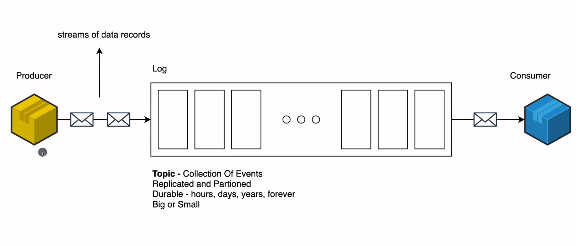

# Learn Apache Kafka

### Lnks

- [Kafka](https://kafka.apache.org/documentation/) | Kafka documentation
- [Install Kafka Broker](https://kafka.apache.org/documentation/#quickstart) | Install broker from the following link
- [AWS Apache Kafka (MSK)](https://aws.amazon.com/msk/) | Amazon Managed Streaming for Apache Kafka (MSK)
- [Spring Boot Apache Kafka Documentation](https://spring.io/projects/spring-kafka) | Spring for Apache Kafka
  

## Cheat Sheet

## Notes
- Download Kafka
  - https://www.apache.org/dyn/closer.cgi?path=/kafka/3.4.0/kafka_2.13-3.4.0.tgz
  - tar -xzf kafka_2.13-3.4.0.tgz
  - cd kafka_2.13-3.4.0
- Run Kafka (into kafka directory run the scripts):
  - bin/zookeeper-server-start.sh config/zookeeper.properties | Kafka Start the ZooKeeper service
  - bin/kafka-server-start.sh config/server.properties | Start the Kafka broker service
- Read Kafka Events
  - bin/kafka-console-consumer.sh --topic quickstart-events --from-beginning --bootstrap-server localhost:9092 | To read events, NOTE to change quickstart-events with my own topic in this case is syscomz

## Description

- Kafka

  - In kafka we have
    - Producer (produce data) -> (streams of data records) -> Log (Topic - Collection of events replicated and partitioned durable - hours, days, years, forever. Big or small) -> Consumer (consumes filtered data)
    - To run kafka check <a href="https://kafka.apache.org/documentation/#quickstart" target="_blank"> this link here.</a>

