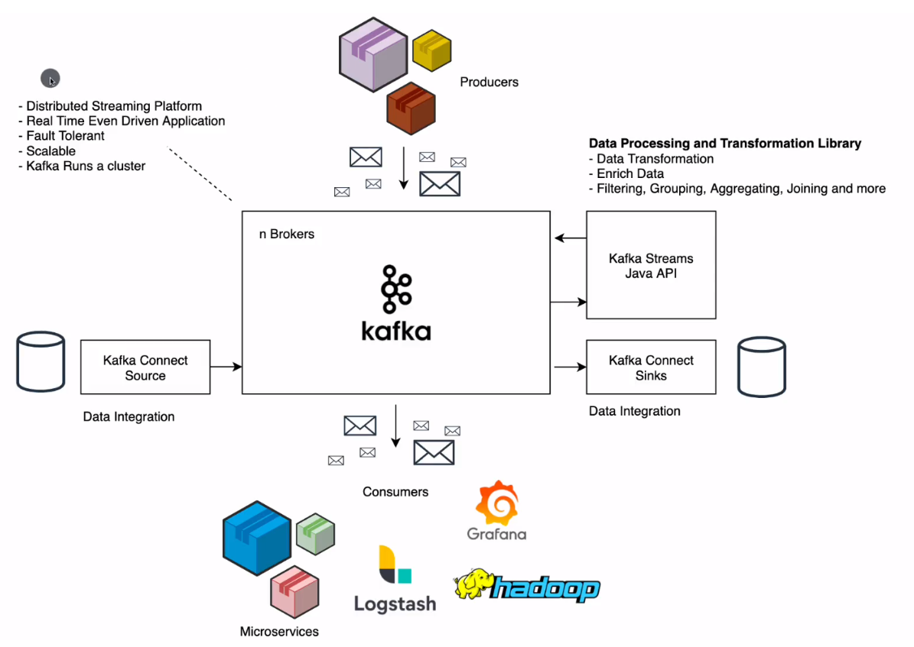

# Learn Apache Kafka

### Lnks

- [Kafka](https://kafka.apache.org/documentation/) | Kafka documentation
- [Install Kafka Broker](https://kafka.apache.org/documentation/#quickstart) | Install broker from the following link

## Cheat Sheet

## Notes

## Description

- Kafka
  
    - In kafka we have
        - Producer (produce data) -> (streams of data records) -> Log (Topic - Collection of events replicated and partitioned durable - hours, days, years, forever. Big or small) -> Consumer (consumes filtered data)
        - To run kafka check <a href="https://kafka.apache.org/documentation/#quickstart" target="_blank"> this link here.</a>
    